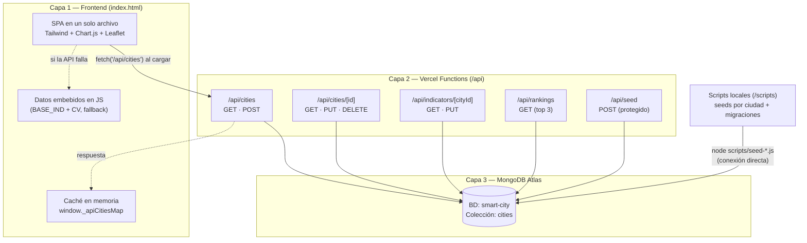

# Documentación Técnica — ICCI

**Índice de Ciudad Inteligente para Ciudades de Frontera**

Plataforma web que calcula, visualiza y compara el índice de ciudad inteligente de ciudades fronterizas de Latinoamérica. Proyecto de tesis desarrollado por un equipo de 5 estudiantes de Ingeniería TIC. El proyecto evaluó inicialmente a Cúcuta (Colombia) y se expandió a un modelo comparativo multi-ciudad.

- **Producción:** https://cucuta-smart-city.vercel.app
- **Repositorio:** https://github.com/angelxtillo/iot

---

## Tabla de contenido

1. [Arquitectura del sistema](#1-arquitectura-del-sistema)
2. [Stack tecnológico](#2-stack-tecnológico)
3. [Estructura de archivos](#3-estructura-de-archivos)
4. [Modelo de datos](#4-modelo-de-datos)
5. [Fórmulas de cálculo](#5-fórmulas-de-cálculo)
6. [Endpoints de la API](#6-endpoints-de-la-api)
7. [Flujo de despliegue](#7-flujo-de-despliegue)
8. [Guía de mantenimiento](#8-guía-de-mantenimiento)
9. [Deuda técnica conocida](#9-deuda-técnica-conocida)

---

## 1. Arquitectura del sistema

El sistema tiene tres capas: un frontend SPA de un solo archivo, una capa de API serverless y una base de datos en la nube.



### Estrategia "API primero, fallback embebido"

El frontend contiene una copia embebida de los datos (constantes `BASE_IND` y `CV` en `index.html`), pero al cargar la página lanza `preloadApiCities()` (no bloqueante), que consulta `GET /api/cities` y guarda las respuestas en `window._apiCitiesMap` indexadas por *slug*. En cada vista:

- Si la ciudad existe en MongoDB con estructura `dimensiones` (modelo oficial de 60 indicadores), la UI la usa como **fuente de verdad**: promedios por dimensión, `indice_compuesto_final` y detalle de cada indicador con justificación, fuente y año.
- Si la API está caída o la ciudad no está seeded con el modelo oficial, la UI calcula todo en el cliente con los datos embebidos (vista "legacy").

Esto permite que la plataforma funcione incluso con MongoDB Atlas pausado, degradando a los datos embebidos.

---

## 2. Stack tecnológico

| Pieza | Tecnología | Por qué se eligió |
|---|---|---|
| Maquetación / estilos | **HTML5 + Tailwind CSS (CDN)** | Sin proceso de build: un solo `index.html` desplegable en cualquier hosting estático. Tailwind por CDN da un sistema de diseño consistente sin configurar tooling. |
| Gráficas | **Chart.js 4 (CDN)** | Cubre los tres tipos de visualización del proyecto (barras, radar, barras horizontales comparativas) con una API simple y sin dependencias. |
| Mapa | **Leaflet 1.9.4 + OpenStreetMap** | Mapa interactivo gratuito y sin API key (a diferencia de Google Maps), ideal para un proyecto académico. |
| Tipografía | **Inter (Google Fonts)** | Legibilidad en tablas densas de datos numéricos (usa `tabular-nums` para alinear cifras). |
| Backend | **Vercel Functions (Node.js ≥ 18)** | Serverless: sin servidor que administrar ni costos fijos; cada archivo en `/api` se convierte automáticamente en un endpoint. |
| Base de datos | **MongoDB Atlas (driver `mongodb` 6.x)** | Modelo de documentos flexible: cada ciudad es un documento con dimensiones e indicadores anidados, sin migraciones de esquema al evolucionar el modelo (v5.3 → v5.4). Tier gratuito suficiente para la tesis. |
| Lectura de Excel | **SheetJS (`xlsx` 0.18)** | El modelo de indicadores de Cúcuta se mantiene en Excel (`ModeloCiudadInteligenteCucuta_v5_4.xlsx`); `xlsx` permite importarlo a MongoDB sin transcribir a mano. |
| Variables de entorno | **dotenv** | Carga `MONGODB_URI` y `SEED_SECRET` desde `.env` en desarrollo local y scripts. |
| Hosting / CI | **Vercel + GitHub** | Deploy automático en cada push a `main`, previews por rama, y funciones serverless integradas en el mismo repositorio. |

---

## 3. Estructura de archivos

```
iot/
├── index.html                          # Frontend completo (SPA): estilos, datos embebidos y toda la lógica de UI
├── vercel.json                         # Config de Vercel: memoria/duración de funciones + rewrite SPA
├── package.json                        # Dependencias y npm scripts (seeds y migraciones)
├── ModeloCiudadInteligenteCucuta_v5_4.xlsx  # Modelo oficial de Cúcuta: 60 indicadores en 6 hojas (una por dimensión)
├── .env                                # MONGODB_URI y SEED_SECRET (NO se versiona)
│
├── api/                                # Vercel Functions (cada archivo = un endpoint)
│   ├── cities/
│   │   ├── index.js                    # GET (lista todas) · POST (crea ciudad)
│   │   └── [id].js                     # GET · PUT · DELETE por ObjectId
│   ├── indicators/
│   │   └── [cityId].js                 # GET · PUT de indicadores legacy de una ciudad
│   ├── rankings.js                     # GET top 3 ciudades por índice compuesto
│   ├── seed.js                         # POST: repuebla la colección desde lib/cities-data.js (requiere x-seed-secret)
│   └── seed-cucuta.js                  # POST: upsert de Cúcuta desde el Excel (ver deuda técnica §9)
│
├── lib/                                # Código compartido entre API y scripts
│   ├── db.js                           # Conexión singleton a MongoDB (reutiliza conexión en dev)
│   ├── calcular-indice.js              # ★ Fuente canónica del cálculo del índice compuesto
│   ├── score.js                        # Cálculo legacy de puntajes (estructura flat `indicators`)
│   └── cities-data.js                  # Datos legacy: 36 indicadores × 5 ciudades (usado por api/seed.js)
│
└── scripts/                            # Se ejecutan localmente con `node` (conexión directa a Atlas)
    ├── seed.js                         # Repuebla la colección con los datos legacy de lib/cities-data.js
    ├── seed-cucuta-v5.js               # Importa el Excel v5.4 de Cúcuta a MongoDB (upsert)
    ├── seed-san-antonio-v1.js          # Seed de San Antonio del Táchira: 60 indicadores investigados
    ├── seed-ipiales-v1.js              # Seed de Ipiales (misma estructura)
    ├── seed-leticia-v1.js              # Seed de Leticia
    ├── seed-pacaraima-v1.js            # Seed de Pacaraima
    ├── seed-juarez-v1.js               # Seed de Ciudad Juárez
    ├── migrar-indice.js                # Recalcula indice_compuesto_final de todas las ciudades con calcularIndice()
    └── migrar-slugs.js                 # Genera/normaliza el campo slug de todas las ciudades
```

**Nota sobre los scripts:** todos los scripts fuerzan DNS de Google/Cloudflare (`dns.setServers(['8.8.8.8','1.1.1.1'])`) porque el ISP local bloquea las consultas SRV (`mongodb+srv://`) que necesita el driver para resolver el clúster de Atlas.

---

## 4. Modelo de datos

Coexisten **dos generaciones** de estructura de datos:

| Generación | Dónde vive | Estructura | Estado |
|---|---|---|---|
| **Legacy (flat)** | `lib/cities-data.js`, campo `indicators[]` en Mongo, `BASE_IND`+`CV` en `index.html` | Array plano de indicadores con `dim`, `tipo`, `val`, `ref` | Fallback del frontend y de `api/seed.js` |
| **Oficial (v5.x, `dimensiones`)** | Documentos de MongoDB creados por `scripts/seed-*.js` | Objeto `dimensiones` con 6 llaves, cada una con peso, promedio e indicadores completos | Fuente de verdad actual |

### 4.1 Frontend embebido: `BASE_IND` + `CV` + `CITIES_META` (index.html)

`BASE_IND` define el **catálogo de 60 indicadores** (10 por dimensión) con id, dimensión, nombre, unidad, tipo y referencia óptima. Ejemplo real:

```js
const BASE_IND = [
  {id:"ch1", dim:"Capital Humano", name:"Educación secundaria y superior", unit:"%",
   tipo:"pos", ref:65, desc:"Proporción de la población con educación secundaria y superior."},
  {id:"cs2", dim:"Cohesión Social", name:"Tasa de homicidios", unit:"por 100k hab",
   tipo:"neg", ref:12, desc:"Homicidios por cada 100.000 habitantes al año."},
  // ... 58 más: ch1-ch10, cs1-cs10, ec1-ec10, go1-go10, ma1-ma10, fr1-fr10
];
```

`CV` ("City Values") contiene los **valores reales por ciudad**, indexados por el id del indicador. `null` significa "sin dato" (la UI muestra N/D y el indicador se excluye del promedio):

```js
const CV = {
  cucuta:    {ch1:43, ch2:28, /* ... */ cs2:36, ec1:3227, ma2:52, fr1:320, fr2:12775000, /* ... */},
  sanantonio:{ch1:38, /* ... */ fr9:null, /* ... */},   // fr9 sin dato
  // ipiales, leticia, pacaraima, juarez
};
```

`CITIES_META` aporta los metadatos (incluidas coordenadas para el mapa), y `CITIES` se construye cruzando las tres estructuras:

```js
const CITIES_META = [
  {key:'cucuta', name:'Cúcuta', country:'Colombia', flag:'🇨🇴', population:750000,
   region:'Norte de Santander', lat:7.8939, lng:-72.5078},
  // San Antonio del Táchira, Ipiales, Leticia, Pacaraima, Ciudad Juárez
];

const CITIES = CITIES_META.map(m => ({
  ...m,
  indicators: BASE_IND.map(b => ({ ...b, val: CV[m.key][b.id] ?? null }))
}));
```

**Ciudades actuales (6):** Cúcuta 🇨🇴, San Antonio del Táchira 🇻🇪, Ipiales 🇨🇴, Leticia 🇨🇴, Pacaraima 🇧🇷 y Ciudad Juárez 🇲🇽. La expansión a otras ciudades fronterizas de Latinoamérica (Tijuana, Foz do Iguaçu, Tacna, Tulcán) está contemplada en el diseño del proyecto pero aún no está implementada en el código.

### 4.2 Dimensiones y pesos (`DIMENSIONS` / `W` / `PESOS_KEY`)

Las 6 dimensiones y sus pesos están definidos de forma consistente en tres lugares (frontend `W`, `lib/score.js` `dimWeights`, `lib/calcular-indice.js` `PESOS_KEY`):

```js
// index.html
const DIMS = ['Frontera','Economía','Capital Humano','Cohesión Social','Gobernanza','Medio Ambiente'];
const W    = {Frontera:0.20, Economía:0.16, 'Capital Humano':0.16,
              'Cohesión Social':0.16, Gobernanza:0.16, 'Medio Ambiente':0.16};

// lib/calcular-indice.js (llaves internas de Mongo)
const PESOS_KEY = { capital_humano:16, cohesion_social:16, economia:16,
                    gobernanza:16, medio_ambiente:16, frontera:20 };
```

La dimensión **Frontera (20 %)** es el aporte original del proyecto: mide comercio binacional, flujo migratorio, infraestructura de paso fronterizo e integración. Las otras cinco pesan 16 % cada una (total = 100 %).

Conceptualmente, el marco metodológico del ICCI también clasifica cada indicador en dos categorías: **"Sostenible"** (desarrollo urbano tradicional: educación, salud, seguridad, ambiente) e **"IoT"** (tecnología y conectividad: sensores, cobertura de red, plataformas digitales). Esta clasificación proviene del modelo de la tesis (Excel) y **no está implementada como campo en el código ni en la base de datos**; si se quisiera materializar, bastaría agregar un campo `categoria` a cada indicador.

### 4.3 Documento de ciudad en MongoDB (estructura oficial `dimensiones`)

BD `smart-city`, colección `cities`. Ejemplo real (extracto del documento de San Antonio del Táchira generado por `scripts/seed-san-antonio-v1.js`):

```js
{
  name: 'San Antonio del Táchira',
  slug: 'san-antonio-del-tachira',        // clave de matching con el frontend
  ciudad: 'San Antonio del Táchira',      // alias en español (compatibilidad)
  pais: 'Venezuela', country: 'Venezuela',
  bandera: '🇻🇪', flag: '🇻🇪',
  poblacion: 71630, population: 71630,
  region: 'Táchira',
  dimensiones: {
    capital_humano: {
      peso: 16,
      puntaje_promedio: 2.4818,           // promedio de los puntajes de sus indicadores
      indicadores: [
        {
          numero: 3,
          nombre: 'Cobertura Educación Superior',
          descripcion: 'Cobertura Educación Superior',
          tipo: 'Positivo',               // 'Positivo' ↑ o 'Negativo' ↓
          valor_real: 17,
          referencia_optima: 70,
          puntaje: 2.4286,                // (17/70)×10
          justificacion: 'DATO — ENCOVI 2023 + Observatorio de Universidades…',
          fuente_url: 'https://www.fundaredes.org/…',
          año: '2023',
          exacto: true                    // true = DATO confirmado · false = ESTIMADO
        },
        // ... resto de indicadores de la dimensión
      ]
    },
    cohesion_social: { /* peso, puntaje_promedio, indicadores */ },
    economia:        { /* … */ },
    gobernanza:      { /* … */ },
    medio_ambiente:  { /* … */ },
    frontera:        { /* … */ }
  },
  indice_compuesto_final: 2.6, // suma ponderada — única fuente de verdad para ranking/resumen
  metadata: { version: 'v1.0', año_datos: '2022-2023', nota: '…' },
  createdAt: ISODate('…'), updatedAt: ISODate('…')
}
```

El modelo oficial de Cúcuta v5.4 tiene **60 indicadores** distribuidos así: Capital Humano 13, Cohesión Social 13, Economía 6, Gobernanza 7, Medio Ambiente 11, Frontera 10.

Los documentos legacy (creados por `api/seed.js` / `scripts/seed.js`) usan en cambio un array plano `indicators[]` con la forma de `lib/cities-data.js`:

```js
{ id: 1, dim: 'Frontera', ind: 'Volumen Comercio Transfronterizo', tipo: 'pos',
  ref: 500, val: 320, fuente: 'DIAN',
  form: 'V_com = Σ (Exp + Imp)', vars: '<b>V_com:</b> …', desc: 'Millones de USD por año…' }
```

`lib/calcular-indice.js` soporta ambas estructuras (ver §5.3).

---

## 5. Fórmulas de cálculo

### 5.1 Puntaje de un indicador (0 a 10)

Cada indicador es **Positivo ↑** (más es mejor) o **Negativo ↓** (menos es mejor):

```
Positivo:  puntaje = min(10, max(0, (valor_real / referencia_óptima) × 10))
Negativo:  puntaje = min(10, max(0, (referencia_óptima / valor_real) × 10))
```

Casos borde (definidos en `calcScoreIndicador` de `lib/calcular-indice.js`):
- Negativo con `valor_real = 0` → puntaje 0 (evita división por cero).
- Positivo con `referencia_óptima = 0` → puntaje 0.
- En el frontend, `val === null` → puntaje `null` (el indicador se excluye del promedio de su dimensión).

**Ejemplos numéricos reales:**

| Indicador (Cúcuta) | Tipo | Valor real | Ref. óptima | Cálculo | Puntaje |
|---|---|---|---|---|---|
| Conectividad escolar | Positivo ↑ | 90 % | 95 % | (90/95)×10 | **9.47** |
| Tasa de homicidios | Negativo ↓ | 36 /100k | 12 /100k | (12/36)×10 | **3.33** |
| Flujo migratorio formal | Positivo ↑ | 12 775 000 | 5 000 000 | (12 775 000/5 000 000)×10 = 25.6 → recortado | **10.00** |
| Balanza comercial (San Antonio) | Positivo ↑ | −470 000 | 400 000 | negativo → max(0, …) | **0.00** |

### 5.2 Promedio por dimensión

```
puntaje_dimensión = Σ puntajes de sus indicadores / número de indicadores (con dato)
```

### 5.3 Índice compuesto final

```
ICCI = Σ (puntaje_dimensión × peso_dimensión / 100)
```

**Ejemplo numérico real (Cúcuta v5.4** — promedios verificados en `scripts/seed-cucuta-v5.js`**):**

| Dimensión | Promedio | Peso | Aporte |
|---|---|---|---|
| Capital Humano | 5.98 | 16 % | 0.9568 |
| Cohesión Social | 5.96 | 16 % | 0.9536 |
| Economía | 5.34 | 16 % | 0.8544 |
| Gobernanza | 6.83 | 16 % | 1.0928 |
| Medio Ambiente | 5.02 | 16 % | 0.8032 |
| Frontera | 6.94 | 20 % | 1.3880 |
| **ICCI** | | **100 %** | **≈ 6.05** → nivel **Medio** |

La implementación canónica es `calcularIndice(city)` en `lib/calcular-indice.js` (el comentario del archivo lo dice explícitamente: *"NUNCA duplicar esta lógica en otros archivos"*). Soporta tres estructuras de documento en este orden:

1. `dimensiones.X.indicadores[].puntaje` → promedia y pondera.
2. `dimensiones.X.puntaje_promedio` → pondera directamente.
3. `indicators[]` legacy → calcula puntaje por indicador, promedia por `dim` y pondera.

El resultado se **almacena** en el campo `indice_compuesto_final` del documento; las APIs y el frontend leen ese campo como única fuente de verdad y solo recalculan si falta.

### 5.4 Escala de interpretación

| Rango | Nivel | Interpretación |
|---|---|---|
| 0.0 – 3.9 | **Bajo** | Ciudad con desafíos críticos en múltiples dimensiones. |
| 4.0 – 5.9 | **Medio-Bajo** | Avances parciales; requiere mejoras sustanciales. |
| 6.0 – 7.4 | **Medio** | Ciudad en desarrollo con fortalezas sectoriales. |
| 7.5 – 8.9 | **Alto** | Ciudad inteligente consolidada con buenas prácticas. |
| 9.0 – 10.0 | **Muy Alto** | Ciudad de referencia global en inteligencia urbana. |

Además hay un **semáforo** independiente para puntajes individuales: 🟢 ≥ 7.0 · 🟠 4.0–6.9 · 🔴 < 4.0 · ⚪ sin dato.

---

## 6. Endpoints de la API

Todas las funciones devuelven JSON con la envolvente `{ success: boolean, ... }`, tienen CORS abierto (`Access-Control-Allow-Origin: *`) y corren con 128 MB / 30 s máx. (`vercel.json`). Base URL: `https://cucuta-smart-city.vercel.app`.

### `GET /api/cities`

Lista todas las ciudades con sus puntajes. Es el endpoint que consume el frontend al cargar.

**Respuesta 200 (ejemplo):**
```json
{
  "success": true,
  "data": [
    {
      "_id": "664a1f...",
      "name": "Cúcuta",
      "slug": "cucuta",
      "country": "Colombia",
      "flag": "🇨🇴",
      "population": 800000,
      "region": "Norte de Santander",
      "indice_compuesto_final": 6.0488,
      "compositeScore": 6.0488,
      "dimScores": { "Frontera": 6.94, "Economía": 5.34, "Capital Humano": 5.98,
                     "Cohesión Social": 5.96, "Gobernanza": 6.83, "Medio Ambiente": 5.02 },
      "dimensiones": { "capital_humano": { "peso": 16, "puntaje_promedio": 5.98, "indicadores": [ "…" ] }, "…": "…" },
      "updatedAt": "2026-05-18T..."
    }
  ]
}
```

### `POST /api/cities`

Crea una ciudad (estructura legacy). Body JSON: `name` y `country` obligatorios; `flag`, `population`, `region`, `indicators[]` opcionales. Respuesta `201` con el documento creado. Errores: `400` si faltan campos.

### `GET /api/cities/:id`

Devuelve el documento completo de una ciudad por su ObjectId, enriquecido con `indice_compuesto_final`, `compositeScore` y `dimScores`. Errores: `400` id inválido, `404` no encontrada.

### `PUT /api/cities/:id`

Reemplaza los campos enviados en el body (`$set`) y **recalcula automáticamente** `indice_compuesto_final` con `calcularIndice()`. Respuesta `200` con el documento actualizado.

### `DELETE /api/cities/:id`

Elimina la ciudad. Respuesta `200` con `{ success: true, message: "Ciudad eliminada correctamente" }`.

### `GET /api/indicators/:cityId`

Devuelve los indicadores **legacy** (`indicators[]`) de una ciudad con su `score` calculado. No aplica a ciudades que solo tienen `dimensiones`. Respuesta: `{ success, cityName, data: [ { id, dim, ind, tipo, val, ref, fuente, score, … } ] }`.

### `PUT /api/indicators/:cityId`

Actualiza valores de indicadores legacy en lote y recalcula el índice.

**Body:**
```json
{ "updates": [ { "id": 1, "val": 350 }, { "id": 33, "val": 40 } ] }
```

**Respuesta 200:** `{ "success": true, "indice_compuesto_final": 5.1234, "data": [ …indicadores con score… ] }`

### `GET /api/rankings`

Devuelve el **top 3** de ciudades ordenadas por `indice_compuesto_final` descendente (solo metadatos + puntaje, sin indicadores). Nota: el ranking completo de la UI no usa este endpoint; se arma en el cliente con los datos de `/api/cities`.

### `POST /api/seed`

Repuebla la colección completa (`deleteMany` + `insertMany`) con los datos legacy de `lib/cities-data.js`. **Destructivo** — protegido con header `x-seed-secret`, que debe coincidir con la variable de entorno `SEED_SECRET`. Errores: `401` sin/mal secreto, `405` si no es POST.

```bash
curl -X POST https://cucuta-smart-city.vercel.app/api/seed -H "x-seed-secret: $SEED_SECRET"
```

⚠️ Este seed usa el modelo legacy de 36 indicadores y **sobrescribe** los documentos v5.x. Tras ejecutarlo habría que volver a correr los seeds oficiales de `/scripts`.

### `POST /api/seed-cucuta`

Upsert de Cúcuta leyendo el Excel del repositorio desde el propio servidor de Vercel (se creó para evitar el bloqueo de red del ISP local). No requiere secreto porque solo hace upsert de un documento. **Actualmente roto**: ver §9.

---

## 7. Flujo de despliegue

```
git push origin main  →  GitHub (angelxtillo/iot)  →  Vercel (build automático)
                                                          ├─ index.html  → hosting estático (SPA)
                                                          └─ api/**/*.js → serverless functions
```

1. Vercel está conectado al repo `angelxtillo/iot`; cada push a `main` dispara un deploy a producción (`cucuta-smart-city.vercel.app`) y cada push a otra rama genera un preview.
2. No hay paso de build: `index.html` se sirve tal cual y cada `.js` dentro de `/api` se convierte en una función.
3. `vercel.json` define:
   - `functions`: 128 MB de memoria y 30 s de duración máxima para `api/**/*.js`.
   - `rewrites`: toda ruta que no empiece por `/api/` se reescribe a `/index.html` (comportamiento SPA).

### Variables de entorno

| Variable | Dónde se usa | Descripción |
|---|---|---|
| `MONGODB_URI` | `lib/db.js`, todos los scripts | Cadena de conexión `mongodb+srv://…` de MongoDB Atlas. Obligatoria: sin ella la API lanza error al arrancar. |
| `SEED_SECRET` | `api/seed.js` | Secreto compartido que autoriza el seed destructivo vía HTTP. |

Deben configurarse en **Vercel → Project → Settings → Environment Variables** (producción) y en el archivo local **`.env`** (desarrollo y scripts). `.env` está en `.gitignore` y nunca se versiona.

Para desarrollo local: `npm run dev` (usa `vercel dev`, que sirve el frontend y las funciones juntas). En Atlas, verificar que la IP local esté en la allowlist de Network Access y que el clúster no esté pausado (los clústeres gratuitos se pausan por inactividad).

---

## 8. Guía de mantenimiento

### 8.1 Cómo agregar una ciudad nueva

1. **Crear el script de seed** copiando el más reciente como plantilla:
   ```bash
   cp scripts/seed-juarez-v1.js scripts/seed-mi-ciudad-v1.js
   ```
2. **Editar el script**: reemplazar en `DIMENSIONES_RAW` los indicadores de cada dimensión (`numero`, `nombre`, `tipo`, `valor_real`, `referencia_optima`, `justificacion`, `fuente_url`, `año`, `exacto`) y en `doc` los metadatos (`name`, `slug`, `country`, `flag`, `population`, `region`). El `slug` debe ser el nombre en minúsculas, sin tildes y con guiones (usar la misma regla de `toSlug`: "Foz do Iguaçu" → `foz-do-iguacu`). Los puntajes y promedios se calculan solos.
3. **Registrar el npm script** en `package.json`:
   ```json
   "seed-mi-ciudad": "node scripts/seed-mi-ciudad-v1.js"
   ```
4. **Ejecutar el seed**: `npm run seed-mi-ciudad` (hace upsert por `slug`; es seguro re-ejecutarlo).
5. **Agregar la ciudad al frontend** en `index.html`:
   - Nueva entrada en `CITIES_META` con `key`, nombre, país, bandera, población, región y **coordenadas** (`lat`/`lng` para el mapa).
   - Nueva entrada en `CV` con los valores para los 60 indicadores embebidos (usar `null` donde no haya dato). Este paso es necesario porque el fallback y el mapa usan los datos embebidos.
6. Verificar en `GET /api/cities` que aparece con `dimensiones` e `indice_compuesto_final`, y en la UI que el Resumen muestra el badge "Modelo oficial".

### 8.2 Cómo agregar o modificar un indicador

**En el modelo oficial (MongoDB):**
1. Editar el array `indicadores` de la dimensión correspondiente en el script de seed de cada ciudad afectada (y en el Excel, si es Cúcuta: agregar la fila en la hoja de la dimensión).
2. Re-ejecutar los seeds (`npm run seed-cucuta`, `npm run seed-san-antonio`, …). Los promedios y el índice se recalculan automáticamente.
3. Recordar definir bien el `tipo` (`'Positivo'`/`'Negativo'`) y una `referencia_optima` justificada: la referencia es el valor con el que el indicador alcanza puntaje 10.

**En el catálogo embebido del frontend:** agregar la entrada en `BASE_IND` (id nuevo con el prefijo de su dimensión, p. ej. `ma11`) y el valor correspondiente en `CV` para **cada** ciudad.

### 8.3 Cómo actualizar valores de indicadores existentes

- **Vía scripts (recomendado):** editar `valor_real` (y `justificacion`/`año`/`fuente_url`) en el script de seed y re-ejecutarlo. Para Cúcuta, editar el Excel v5.4 y correr `npm run seed-cucuta`.
- **Vía API (solo estructura legacy):** `PUT /api/indicators/:cityId` con `{ updates: [{ id, val }] }`.
- **Vía API (documento completo):** `PUT /api/cities/:id` — recalcula el índice automáticamente.

### 8.4 Scripts de migración

- `npm run migrar-indice` — recalcula y guarda `indice_compuesto_final` de **todas** las ciudades usando `calcularIndice()`. Ejecutar siempre que se toque un valor directamente en Mongo o se cambie la lógica de cálculo, para que ranking y resumen queden sincronizados.
- `npm run migrar-slugs` — regenera el campo `slug` de todas las ciudades. Ejecutar si se renombra una ciudad.

### 8.5 Reglas de oro

1. **Nunca duplicar la lógica del índice**: todo cálculo debe pasar por `lib/calcular-indice.js`.
2. `indice_compuesto_final` almacenado es la única fuente de verdad; después de cualquier cambio de datos, correr `migrar-indice`.
3. El matching frontend ↔ MongoDB es por **slug**: si el `name` del frontend y el `slug` de Mongo no se corresponden vía `toSlug()`, la ciudad se verá con datos embebidos en lugar de los oficiales.
4. Pesos: si se cambia la ponderación, actualizar los tres lugares (`W` en index.html, `dimWeights` en score.js, `PESOS_KEY` en calcular-indice.js) y re-ejecutar `migrar-indice`.

---

## 9. Deuda técnica conocida

| Ítem | Detalle |
|---|---|
| `api/seed-cucuta.js` roto | Referencia `ModeloCiudadInteligenteCucuta_v5_3.xlsx`, pero el repo ahora contiene la **v5_4**. El endpoint devuelve error 500 hasta actualizar la ruta. Usar `npm run seed-cucuta` (que sí apunta a v5_4) mientras tanto. |
| `lib/cities-data.js` desactualizado | Modelo legacy de 36 indicadores y 5 ciudades (sin Juárez); los comentarios de sección aún dicen "Economía 17 %" y "Medio Ambiente 15 %" (pesos antiguos). Solo lo usan `api/seed.js` y `scripts/seed.js`; ejecutarlos sobrescribiría los datos oficiales v5.x. |
| Doble módulo de scoring | `lib/score.js` (legacy) y `lib/calcular-indice.js` (canónico) coexisten; las APIs de cities usan ambos. Consolidar en calcular-indice.js. |
| Población de Cúcuta inconsistente | 750 000 en frontend/`cities-data.js` vs 800 000 en los seeds v5.x. |
| Clasificación Sostenible/IoT no implementada | Existe en el marco metodológico (Excel/tesis) pero no como campo en código/BD. |
| `/api/rankings` limitado | Devuelve solo el top 3; el ranking completo se arma en el cliente. |
| Ciudades pendientes | Tijuana, Foz do Iguaçu, Tacna y Tulcán: contempladas en el alcance del proyecto, sin seed ni entrada en el frontend todavía. |
